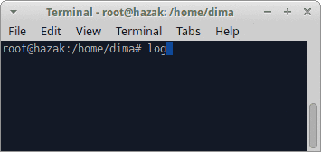

# logfence

## Overview

**logfence** is a [FUSE](http://fuse.sourceforge.net/) based file system that
acts as an overlay, which allows only one process to modify each file at a time.

It is designed to be a simple and effective, generic tool that prevents log
tampering transparently.

## Features

 * Prevents a process from opening a file for writing, if another process writes
   to it
 * Prevents a process from deleting a file, if another process writes to it
 * Prevents a process from _touching_ a file, if another process writes to it
 * Logs all violations to the system log

## Usage Example

**Application A** ([Python](https://www.python.org/)) writes a log file
(_/var/log/fdfd_). The evil **application B** (another instance of
[Python](https://www.python.org/)) tries to ruin the log, but fails because
**logfence** prevents it from opening it for writing.

## Credits and Legal Information

compat/sys/queue.h was taken from [OpenBSD](http://www.openbsd.org/), for wider
compatibility with C libraries; see the legal information at the top.

**logfence** itself is _free_ and unencumbered software released under the terms
of the _MIT license_; see [COPYING](COPYING) for the license text. For a list of
its authors and contributors, see [AUTHORS](AUTHORS).
